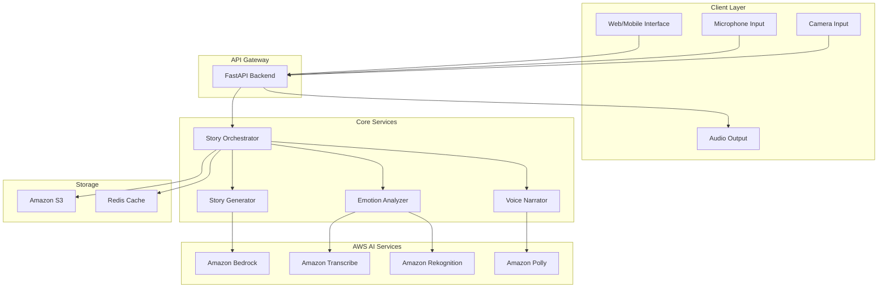

# Design Document

## Overview

The Adaptive Children's Storytelling Agent is a real-time, multimodal AI system that creates personalized storytelling experiences. The system integrates multiple AWS AI services orchestrated through a FastAPI backend to deliver emotionally adaptive narratives. The architecture emphasizes real-time processing, privacy protection, and seamless user experience while maintaining modular design for extensibility.

## Architecture

### High-Level Architecture



### Component Architecture

The system follows a microservices-inspired modular architecture with clear separation of concerns:

1. **API Layer**: FastAPI handles HTTP requests, WebSocket connections, and real-time communication
2. **Orchestration Layer**: Coordinates between services and manages session state
3. **AI Services Layer**: Integrates with AWS AI services for core functionality
4. **Storage Layer**: Manages persistent data and caching

## Components and Interfaces

### 1. Story Orchestrator

**Purpose**: Central coordinator that manages storytelling sessions and orchestrates between all services.

**Key Responsibilities**:
- Session management and state tracking
- Real-time emotion-based story adaptation logic
- Coordination between emotion detection, story generation, and narration
- Privacy-compliant data handling

**Interface**:
```python
class StoryOrchestrator:
    async def start_session(self, child_profile: ChildProfile) -> SessionId
    async def process_emotion_update(self, session_id: SessionId, emotion: EmotionData) -> AdaptationAction
    async def generate_story_segment(self, session_id: SessionId, context: StoryContext) -> StorySegment
    async def end_session(self, session_id: SessionId) -> SessionSummary
```

### 2. Emotion Analyzer

**Purpose**: Processes audio and visual inputs to detect child's emotional state in real-time.

**Key Responsibilities**:
- Audio emotion detection using Amazon Transcribe + tone analysis
- Visual emotion detection using Amazon Rekognition
- Emotion confidence scoring and validation
- Real-time emotion state management

**Interface**:
```python
class EmotionAnalyzer:
    async def analyze_audio(self, audio_stream: AudioStream) -> EmotionResult
    async def analyze_image(self, image_data: ImageData) -> EmotionResult
    async def get_current_emotion(self, session_id: SessionId) -> EmotionState
    def validate_emotion_confidence(self, emotion: EmotionResult) -> bool
```

### 3. Story Generator

**Purpose**: Creates and adapts story content using Amazon Bedrock's generative AI capabilities.

**Key Responsibilities**:
- Initial story generation based on child profile
- Real-time story adaptation based on emotional feedback
- Content appropriateness filtering
- Story continuity and coherence management

**Interface**:
```python
class StoryGenerator:
    async def generate_initial_story(self, profile: ChildProfile, theme: str) -> Story
    async def adapt_story_segment(self, current_story: Story, emotion: EmotionState, goal: EmotionalGoal) -> StorySegment
    async def generate_story_conclusion(self, story_context: StoryContext) -> StoryEnding
    def validate_content_appropriateness(self, content: str, age: int) -> bool
```

### 4. Voice Narrator

**Purpose**: Converts story text to natural, expressive speech using Amazon Polly.

**Key Responsibilities**:
- Text-to-speech conversion with emotional expression
- Voice modulation for different characters
- Pace and tone adjustment based on story context
- Audio streaming for real-time playback

**Interface**:
```python
class VoiceNarrator:
    async def narrate_segment(self, text: str, voice_config: VoiceConfig) -> AudioStream
    async def adjust_voice_for_emotion(self, base_config: VoiceConfig, emotion: EmotionState) -> VoiceConfig
    def create_character_voice(self, character: Character, base_voice: str) -> VoiceConfig
    async def stream_audio(self, audio_data: bytes) -> AsyncIterator[bytes]
```

### 5. Session Manager

**Purpose**: Manages user sessions, preferences, and privacy-compliant data handling.

**Key Responsibilities**:
- Session lifecycle management
- User preference storage and retrieval
- Privacy-compliant data cleanup
- Anonymous user identification

**Interface**:
```python
class SessionManager:
    async def create_session(self, child_profile: ChildProfile) -> Session
    async def update_session_state(self, session_id: SessionId, state: SessionState) -> None
    async def cleanup_session_data(self, session_id: SessionId) -> None
    async def get_user_preferences(self, anonymous_id: str) -> UserPreferences
```

## Data Models

### Core Data Structures

```python
@dataclass
class ChildProfile:
    age: int
    preferences: List[str]
    emotional_goal: EmotionalGoal
    voice_preference: Optional[str]
    anonymous_id: str

@dataclass
class EmotionState:
    primary_emotion: str
    confidence: float
    intensity: float
    timestamp: datetime
    source: str  # 'audio' or 'visual'

@dataclass
class StoryContext:
    current_segment: str
    characters: List[Character]
    setting: str
    plot_points: List[str]
    emotional_arc: List[EmotionState]

@dataclass
class StorySegment:
    text: str
    emotional_tone: str
    pacing: str
    characters_involved: List[str]
    adaptation_reason: Optional[str]

@dataclass
class VoiceConfig:
    voice_id: str
    speed: float
    pitch: float
    volume: float
    emphasis: List[str]
```

### Database Schema

**Sessions Table**:
- session_id (UUID, Primary Key)
- anonymous_user_id (String)
- created_at (Timestamp)
- ended_at (Timestamp, Nullable)
- child_age (Integer)
- emotional_goal (String)

**Story_Segments Table**:
- segment_id (UUID, Primary Key)
- session_id (UUID, Foreign Key)
- sequence_number (Integer)
- content (Text)
- emotional_context (JSON)
- created_at (Timestamp)

**User_Preferences Table**:
- anonymous_user_id (String, Primary Key)
- preferences (JSON)
- updated_at (Timestamp)

## Error Handling

### Error Categories and Strategies

1. **AI Service Failures**:
   - Implement circuit breaker pattern for AWS service calls
   - Fallback to cached responses or default behaviors
   - Graceful degradation (continue story with last known emotional state)

2. **Real-time Processing Errors**:
   - Buffer management for audio/video streams
   - Timeout handling for emotion detection
   - Automatic retry with exponential backoff

3. **Content Generation Issues**:
   - Content filtering and validation
   - Fallback story templates for generation failures
   - Age-appropriateness validation

4. **Privacy and Data Handling**:
   - Automatic data cleanup on errors
   - Secure error logging without sensitive data
   - User consent validation

### Error Recovery Mechanisms

```python
class ErrorHandler:
    async def handle_ai_service_error(self, service: str, error: Exception) -> FallbackAction
    async def handle_stream_interruption(self, session_id: SessionId) -> RecoveryAction
    async def handle_content_generation_failure(self, context: StoryContext) -> FallbackStory
    def log_error_safely(self, error: Exception, context: dict) -> None
```

## Testing Strategy

### Unit Testing

1. **Component Testing**:
   - Mock AWS services for isolated testing
   - Test emotion detection accuracy with sample data
   - Validate story generation logic
   - Test voice synthesis configuration

2. **Integration Testing**:
   - End-to-end story session simulation
   - AWS service integration validation
   - Real-time adaptation testing
   - Privacy compliance verification

3. **Performance Testing**:
   - Real-time processing latency measurement
   - Concurrent session handling
   - Memory usage optimization
   - Audio streaming performance

### Test Data and Scenarios

```python
# Test scenarios for emotional adaptation
test_scenarios = [
    {
        "emotion_sequence": ["neutral", "bored", "engaged"],
        "expected_adaptations": ["introduce_excitement", "maintain_engagement"],
        "story_theme": "adventure"
    },
    {
        "emotion_sequence": ["excited", "anxious", "calm"],
        "expected_adaptations": ["soften_tone", "introduce_comfort"],
        "story_theme": "friendship"
    }
]
```

### Demo Testing Framework

1. **Automated Demo Scenarios**:
   - Pre-recorded emotion sequences
   - Scripted story adaptations
   - Performance metrics collection

2. **Live Demo Capabilities**:
   - Real-time emotion detection demonstration
   - Interactive story adaptation showcase
   - Audience engagement metrics

## Privacy and Security Considerations

### Data Protection Measures

1. **Audio/Video Processing**:
   - Stream processing without persistent storage
   - Immediate deletion after emotion analysis
   - Local processing where possible

2. **User Data Management**:
   - Anonymous user identification
   - Encrypted preference storage
   - Automatic data expiration

3. **Compliance Framework**:
   - COPPA compliance for children's data
   - GDPR compliance for data handling
   - Parental consent management

### Security Implementation

```python
class PrivacyManager:
    async def process_media_stream(self, stream: MediaStream) -> EmotionData
    async def anonymize_user_data(self, user_data: dict) -> str
    async def cleanup_expired_data(self) -> None
    def validate_parental_consent(self, session: Session) -> bool
```

## Deployment and Scalability

### Infrastructure Requirements

1. **AWS Services Configuration**:
   - Amazon Bedrock: Claude-3 or Titan models for story generation
   - Amazon Transcribe: Real-time streaming for voice analysis
   - Amazon Rekognition: Custom emotion detection models
   - Amazon Polly: Neural voices for natural narration
   - Amazon S3: Story templates and user preferences
   - Amazon ElastiCache: Session state and caching

2. **Compute Resources**:
   - ECS/Fargate for containerized FastAPI application
   - Application Load Balancer for high availability
   - Auto Scaling Groups for demand management

3. **Monitoring and Observability**:
   - CloudWatch for metrics and logging
   - X-Ray for distributed tracing
   - Custom metrics for emotion detection accuracy

### Performance Optimization

1. **Real-time Processing**:
   - WebSocket connections for low-latency communication
   - Streaming responses for immediate feedback
   - Parallel processing of audio and visual inputs

2. **Caching Strategy**:
   - Story template caching
   - User preference caching
   - Emotion model result caching

3. **Resource Management**:
   - Connection pooling for AWS services
   - Memory-efficient stream processing
   - Optimized model inference calls