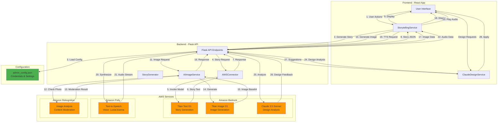
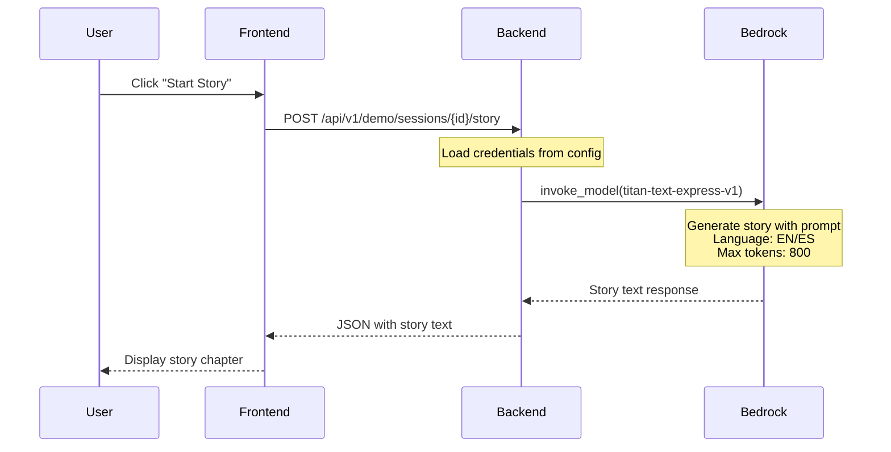
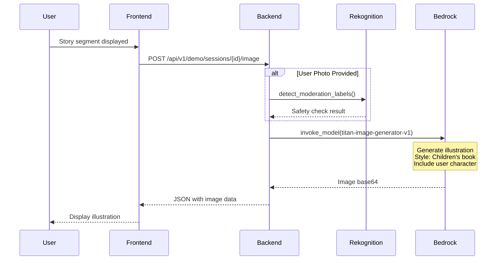
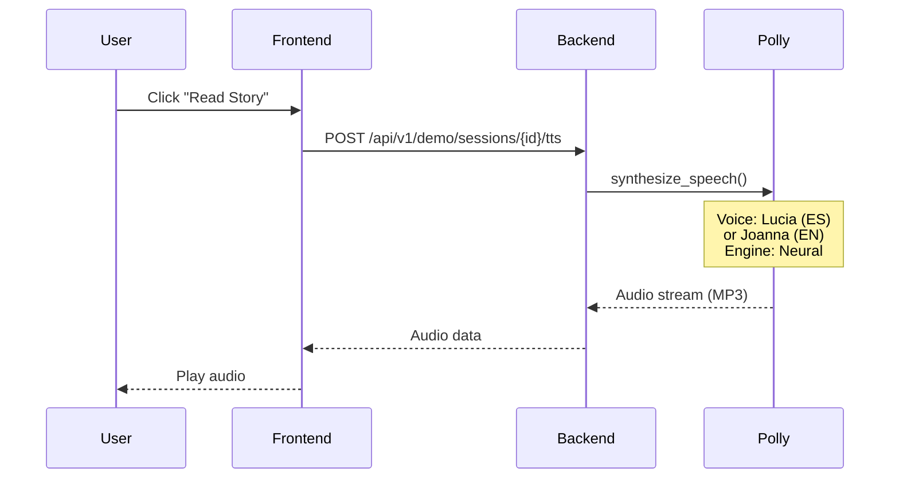
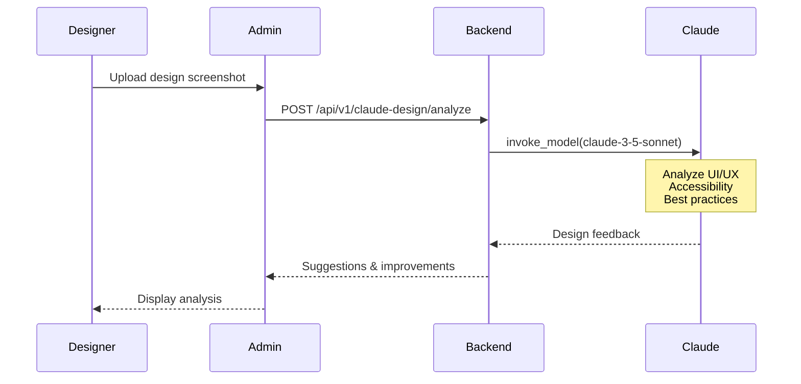
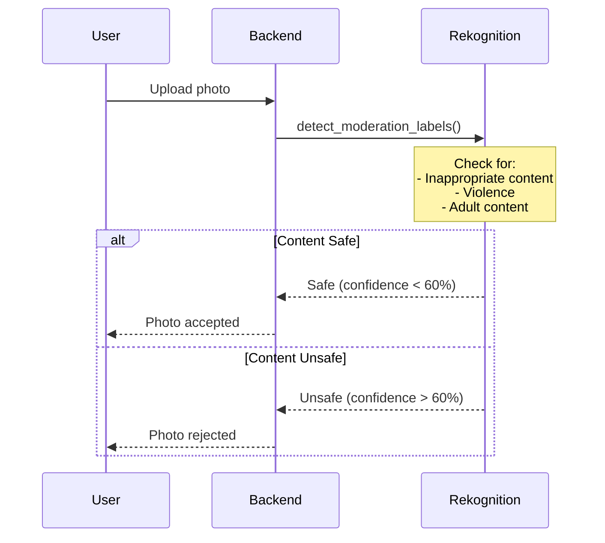
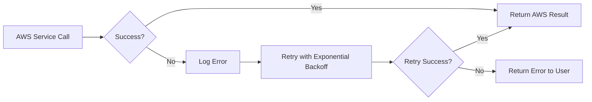

# AWS Services Architecture - DreamAIry

## Diagrama de Arquitectura



## Flujo Detallado por Servicio

### 1. 📚 Story Generation (Amazon Bedrock - Titan Text)



**Endpoint**: `/api/v1/demo/sessions/{session_id}/story`  
**Model**: `amazon.titan-text-express-v1`  
**Input**: Story prompt with context, theme, age, language  
**Output**: Story text (4-6 sentences)  
**Cost**: ~$0.0002 per request

---

### 2. 🎨 Image Generation (Amazon Bedrock - Titan Image)



**Endpoint**: `/api/v1/demo/sessions/{session_id}/image`  
**Model**: `amazon.titan-image-generator-v1`  
**Input**: Scene description, theme, user photo (optional)  
**Output**: Base64 encoded image (1024x1024)  
**Cost**: ~$0.01 per image

---

### 3. 🗣️ Text-to-Speech (Amazon Polly)



**Endpoint**: `/api/v1/demo/sessions/{session_id}/tts`  
**Voices**: 
- Spanish: Lucia (Neural)
- English: Joanna (Neural)
**Output**: MP3 audio stream  
**Cost**: ~$0.000004 per character

---

### 4. 🎭 Design Analysis (Amazon Bedrock - Claude)



**Endpoint**: `/api/v1/claude-design/analyze`  
**Model**: `anthropic.claude-3-5-sonnet-20240620-v1:0`  
**Input**: Design screenshot (base64)  
**Output**: Detailed design analysis and suggestions  
**Cost**: ~$0.003 per request

---

### 5. 🔍 Content Moderation (Amazon Rekognition)



**Endpoint**: Used internally in photo upload  
**Service**: `detect_moderation_labels()`  
**Threshold**: 60% confidence  
**Cost**: ~$0.001 per image

---

## Configuration Structure

```json
{
  "aws": {
    "region": "us-east-1",
    "credentials": {
      "access_key_id": "AKIA...",
      "secret_access_key": "...",
      "session_token": "..."
    }
  },
  "services": {
    "bedrock": {
      "models": {
        "text": "amazon.titan-text-express-v1",
        "image": "amazon.titan-image-generator-v1",
        "claude": "anthropic.claude-3-5-sonnet-20240620-v1:0"
      }
    },
    "polly": {
      "voices": {
        "es": "Lucia",
        "en": "Joanna"
      }
    }
  }
}
```

**Note**: AWS services are always enabled in production. No environment flags needed.

## Cost Estimation (per user session)

| Service | Usage | Cost per Request | Typical Session |
|---------|-------|------------------|-----------------|
| **Titan Text** | 5 story chapters | $0.0002 | $0.001 |
| **Titan Image** | 5 illustrations | $0.01 | $0.05 |
| **Polly TTS** | 500 characters | $0.000004/char | $0.002 |
| **Rekognition** | 1 photo check | $0.001 | $0.001 |
| **Claude Design** | Admin only | $0.003 | N/A |
| **Total per session** | | | **~$0.054** |

## Production Configuration

The application runs in **production mode only** with AWS services always enabled:
- AWS services: **Always Enabled**
- Uses: Real AWS services with monitoring
- Cost: **~$0.054 per session**
- All features: Story generation, image generation, TTS, content moderation

## Security & Best Practices

### ✅ Implemented
- Credentials stored in `admin_config.json` (not in code)
- Content moderation for user photos
- Session-based isolation
- Error handling with fallbacks

### 🔒 Recommendations
- Use AWS IAM roles instead of access keys
- Implement AWS Secrets Manager for credentials
- Add CloudWatch monitoring
- Set up billing alerts
- Use AWS WAF for API protection

## Monitoring & Logging

```python
# Current logging format
logger.info("📚 Using REAL AWS Bedrock for story generation")
logger.info("🎨 Using AWS Bedrock Titan for image generation")
logger.info("🗣️ Using REAL AWS Polly for text-to-speech")
logger.info("🌍 Language received from frontend: {language}")
```

### Recommended CloudWatch Metrics
- Bedrock invocation count
- Bedrock latency
- Polly character count
- Rekognition moderation results
- Error rates per service

## Error Handling Strategy



### Error Handling
- **Story Generation**: Retry up to 3 times, then return error
- **Image Generation**: Retry up to 2 times, then return error
- **Text-to-Speech**: Retry up to 2 times, then return error
- **Content Moderation**: Single attempt, fail-safe to reject on error

## Files Reference

| File | Purpose |
|------|---------|
| `backend/admin/aws_connector.py` | AWS service wrapper |
| `backend/admin/config/admin_config.json` | AWS credentials |
| `backend/app.py` | API endpoints |
| `backend/prompts/story_prompts.py` | Story generation prompts |
| `backend/services/ai_image_service.py` | Image generation logic |
| `backend/api/claude_design.py` | Design analysis API |

## Next Steps

1. **Implement IAM Roles** for better security
2. **Add CloudWatch Dashboards** for monitoring
3. **Set up Cost Alerts** in AWS Billing
4. **Implement Caching** for repeated requests
5. **Add Rate Limiting** to prevent abuse
